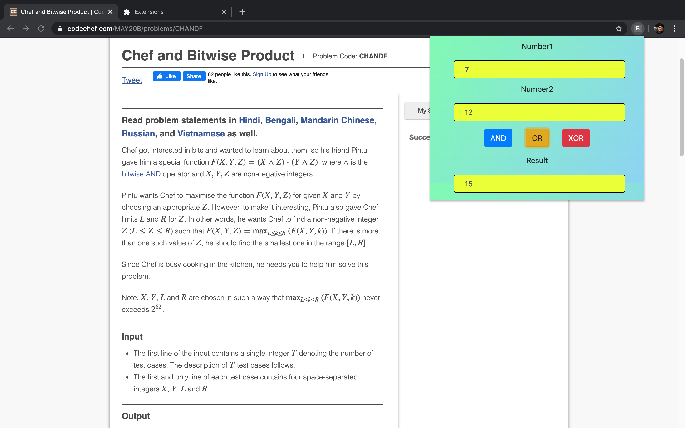

# BitWiseCalculator
Implementation of BitwiseCalculator as a chrome plugin

### How to use :
    * Go to `chrome://extensions/` in your Chrome browser.
    * Click "Load unpacked" (after enabling developer mode) and navigate to the cloned repository directory or the downloaded directory.
   
### Use of this : 
    * It provides a popup which is very handy to work with while you are on a site.
    * It provides a seamless interface which can be helpful in solving Bitwise questions without wasting time in calculations.
    * You worry about the logic and let us worry about calculation.

### ScreenShots
      
  
   
  
   
  

### New version may be on the way with new functionality like :
      * Better UI and original Icon.
      * Binary,Octal and Hexadecimal support.
      * Bit-by-Bit visualization so that it may help you reach your logic soon.
      * ScreenShot feature that may help you take the picture of your new A/C(correct answer).
      and many more..
